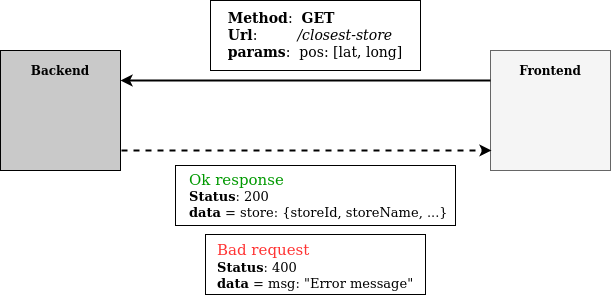
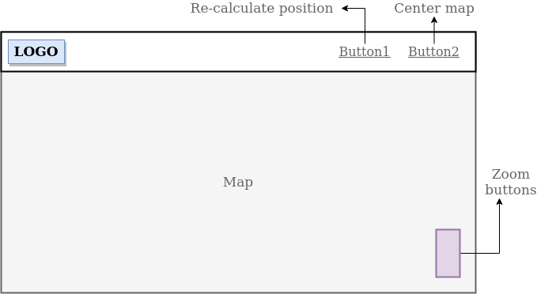

## Content

- [Instructions](#questions)
- [Answers](#answers)
- [Architecture](#architecture)
- [Store](#store)
- [Track](#track)
- [Layout frontend](#layout-frontend)
- [App flow](#app-flow)
- [Deploy](#deploy)
- [Improvements and trade offs](#improvements-and-trade-offs)

## Questions

1. What is the expected format for each of the following fields?

- storeId
- storeName
- isOpen
- coordinates
- nextDeliveryTime

2. For this functional requirement "We need to keep track of each call to the endpoint", is it necessary to use a persistent storage like a DB or is it possible a non-persistent strategy like in-memory?

## Answers

1. The format for those fields:

```
storeId : UUID or String
storeName: String
isOpen: Boolean
coordinates: Array or object with latitude and longitude
nextDeliveryTime: UTC Date
```

2. For the purpose of this exercise you can use whatever you want, just tell us why are you using that strategy (time constraints are a valid reason for that decision).

## Architecture


   
| url                     | method   | description                | params |
| ----------------------- | -------- | -------------------------- | ------------- |
| /store/closest          | GET      | given a position, returns the closest **store** to it | ?latitude=VALUE&longitude=VALUE |
| /store/tracks          | GET       | returns an Array with all stored tracks |  |

### Store

```javascript
{
   storeId : String
   storeName: String
   isOpen: Boolean
   coordinates: Array[latitude, longitude]
   nextDeliveryTime: UTC Date
}
```

### Track

```javascript
{
   date: UTC Date
   position: Array[latitude, longitude]
   ipAddress: string
   closestStoreId: String
}
```

## Layout frontend



## App flow

1. User visit frontend page
2. Ask to user your current position
3. Make a request to backend for the given position
4. Show user position and closest store on the map

## Deploy

[Instastore](https://instastore-front.herokuapp.com)

## Improvements and trade offs

1. What would you improve from your code? why?
  - **Store for tracks**: In order to store correctly all api calls, it should be necessary use a persistent storage like a DB and use this data to get valuable information.
  - **UI design**:The UI is really basic, so for a better user experience is necessary invest more time in the design.
  - **Testing**: Is necessary add tests for frontend and backend, to improve software quality.

3. Which trade offs would you make to accomplish this on time? What'd you do next time to deliver more and sacrifice less?
   I didn't do somethings due to the deadline:
   - Use persistent strategy to save tracks
   - Invest more time in the UI design
   - Add tests

   For the next time, I would like to spend less time on projects setup and deploy steps, I spent more time than expected on those things.

5. Do you think your service is secure? why?
   No. In this moment the API is available for everyone, in order to restrict the access to the API, some strategy like session management or token can be used. 
   
7. What would you do to measure the behaviour of your product on a production environment?
   I would like to do stress testing for whole app.

## Delivery time

From wednesday to friday morning
